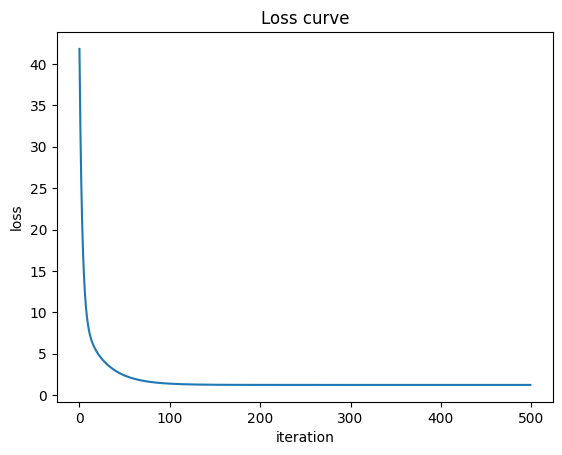
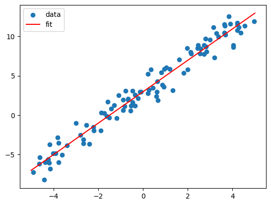

# 手写实现线性回归

## 项目目的
用numpy从零实现线性回归，重点是理解原理，而不是只当个调包仔

## 数学原理
- 模型：y = wx + b
- 损失函数：MSE = (1/n) Σ(y_pred - y)²
- 梯度推导（链式法则，写出过程不是说"用了链式法则"）：
  - 内层 (wx + b - y) 对 w 求导 = x
  - 外层 u² 对 u 求导 = 2u
  - 所以 dw = (2/n) Σ((y_pred - y) * x)
  - db 同理 = (2/n) Σ(y_pred - y)
- 更新：w = w - lr*dw,  b = b - lr*db

## ## 实验结果
- 训练设置：500 轮，lr=0.01，样本数 100
- 损失曲线：
- 拟合效果：
- 数值对比：

| 参数 | 真实值 | 我的实现 | sklearn | 
|------|--------|----------|---------|
| w    | 2.000  | 1.9817   | 1.9817  |
| b    | 3.000  | 3.0633   | 3.0665  |

（说明：sklearn 用解析解，我的是 500 轮梯度下降，b 还差一点是因为没完全收敛）

## 卡点与思考
- 我以前以为 y_pred 应该加 noise，写代码时才意识到预测是确定性的、模型不应该知道 noise 
- 我把数据生成放进了 for 循环，loss 居然还在降，花了点时间才搞懂'训练'其实是反复在同一份数据上更新参数

## 后续改进
- 扩展到多变量回归（会涉及矩阵运算）
- 尝试不同优化器（momentum、Adam）
- 在真实数据集上跑（比如 California Housing）

## 如何运行
依赖：numpy / matplotlib / scikit-learn
运行：uv sync 然后 uv run python main.py